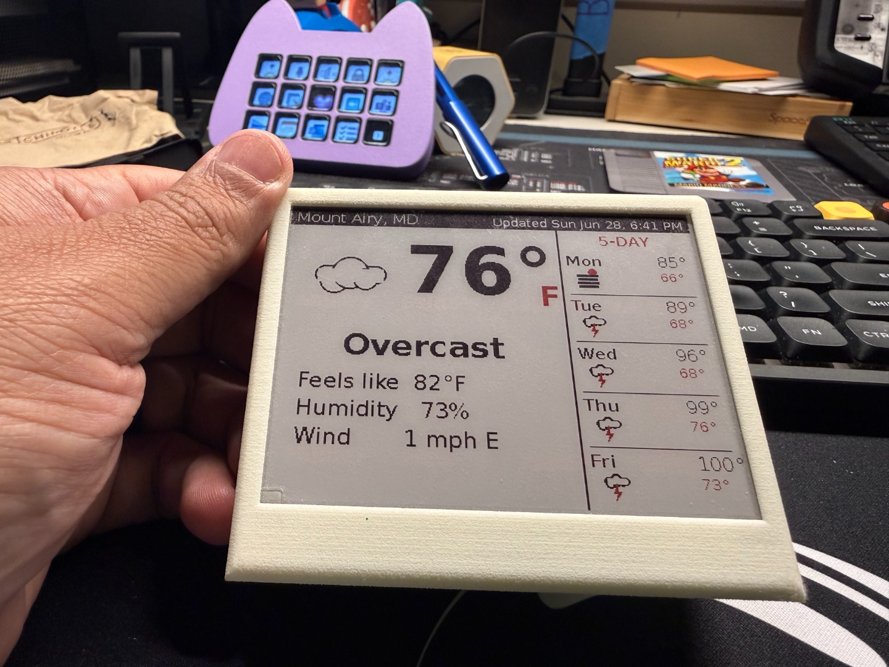
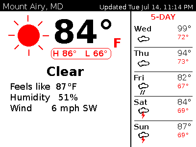
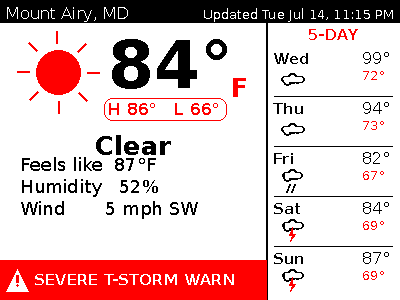
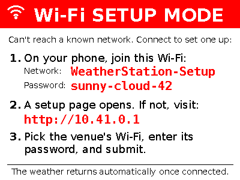
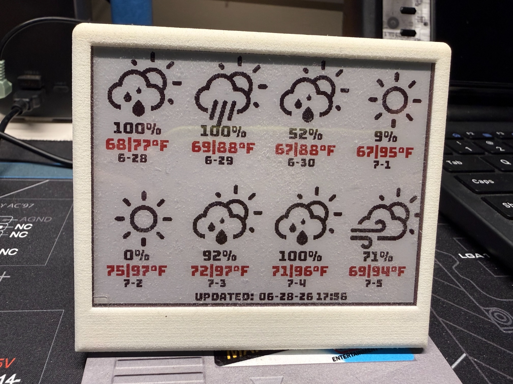

# Inky wHAT Weather Station — 2026 Edition

A simple, **inexpensive weather station** built around a Pimoroni Inky wHAT
e-ink display and a Raspberry Pi Zero 2 W. It shows the **current conditions**
in a large window on the left two-thirds of the screen — including the current
temperature, a **today's high/low** chip, feels-like, humidity, and wind — with
a **5-day forecast** as icons on the right third and a **"last updated"**
timestamp along the top. When the National Weather Service has an active
**watch or warning** for your location, a bold **red alert banner** appears
across the bottom of the current-conditions window. It refreshes **every 30
minutes**, all by itself.

This is a **great weekend project for a cheap weather station**: the parts are
affordable, the e-ink screen sips power and stays readable in daylight, and once
it's running you can hang it on a wall or set it on a desk and forget about it.
Forecast data comes from the free [Open-Meteo](https://open-meteo.com/) API and
watches/warnings from the free [US National Weather Service](https://www.weather.gov/documentation/services-web-api)
API — so there's **no account to create and no API key to manage**.

Because it's fully headless (no keyboard, no screen to type on), it also
includes **phone-based Wi-Fi setup**: take it anywhere, and when it can't find a
known network it opens its own hotspot and shows on-screen instructions so you
can add the new Wi-Fi from your phone. See
[Connecting to a new Wi-Fi network](#connecting-to-a-new-wi-fi-network).



---

## What it looks like

**Rendered layout** (generated by the code — this is exactly what gets pushed to
the panel):



**With an active watch/warning**, a red alert banner appears at the bottom of
the left panel (this render shows a live NWS *Extreme Heat Warning*):



**Wi-Fi setup screen** — shown automatically when the station can't reach a
known network (see [Connecting to a new Wi-Fi network](#connecting-to-a-new-wi-fi-network)):



**On the real e-ink panel, in a 3D-printed enclosure:**

| Current + 5-day view | Alternate forecast-grid view |
|---|---|
|  |  |

> The left photo matches the layout in this repository (current weather in a
> big window, 5-day forecast on the right). The right photo shows an alternate
> all-icons grid layout — a fun variation you can build toward by editing
> `weather.py`.

---

## Hardware — and where to buy it

You only need three things, and an enclosure is a nice optional extra.

| Part | Notes | Where to buy |
|------|-------|--------------|
| **Pimoroni Inky wHAT** (400×300 e-ink) | The display. This project targets the red/black/white look; the driver auto-detects your panel. | [Pimoroni — Inky wHAT](https://shop.pimoroni.com/products/inky-what) · also stocked by [Adafruit](https://www.adafruit.com/product/4127) and [The Pi Hut](https://thepihut.com/products/inky-what-epaper-display) |
| **Raspberry Pi Zero 2 W** | Tiny, low-power, has Wi-Fi. | [Raspberry Pi — approved resellers](https://www.raspberrypi.com/products/raspberry-pi-zero-2-w/) · [Pimoroni](https://shop.pimoroni.com/products/raspberry-pi-zero-2-w) · [Adafruit](https://www.adafruit.com/product/5291) |
| **8 GB+ microSD card** | For Raspberry Pi OS. Any reputable brand is fine. | Any electronics retailer |

> Availability note: the Inky wHAT periodically sells out at Pimoroni. If it's
> out of stock, check the alternate retailers above.

### Enclosure (optional but recommended)

An e-ink display looks fantastic in a little stand or frame. You can buy a
ready-made print or download an STL and print your own from a 3D-printing site
such as Cults3D:

- **[Enclosure for Pimoroni Inky / e-paper + Raspberry Pi Zero (Cults3D)](https://cults3d.com/en/3d-model/gadget/enclosure-for-pimoroni-inky-impression-epaper-eink-epd-and-raspberry-pi-zero)**

(The unit pictured above is printed from a design like this one.) Sites like
Cults3D, Printables, and Thingiverse have several Inky-friendly enclosures —
search for "Inky wHAT case" or "Pimoroni e-paper enclosure."

---

## Software setup (Debian 13 "trixie")

1. **Flash** Raspberry Pi OS (trixie, Lite 64-bit) with Raspberry Pi Imager.
   In Imager's settings, set your hostname, user, Wi-Fi, and enable SSH.
2. **Copy this project** onto the Pi:
   ```bash
   scp -r inky-what-weather-station-2026-edition <user>@<host>.local:~/
   ```
   …or clone it from GitHub directly on the Pi.
3. **Run the installer:**
   ```bash
   cd ~/inky-what-weather-station-2026-edition
   ./install.sh
   sudo reboot
   ```

The installer enables SPI/I2C, adds the `dtoverlay=spi0-0cs` overlay the Inky
driver needs, creates a Python virtual environment with `Pillow` and
`inky[rpi]`, and installs a `systemd` user timer that refreshes the screen every
**30 minutes** (and ~2 minutes after each boot).

### Weather watches & warnings

On each update the station also asks the [US National Weather Service alerts
API](https://www.weather.gov/documentation/services-web-api) for any **active
watches or warnings** at your coordinates. If one is in effect, the most severe
alert is shown in a **red banner** across the bottom of the current-conditions
window (with a `+N MORE` hint if several are active). Advisories, statements,
and test messages are filtered out so only true watches and warnings appear.
The alert lookup is best-effort: if the NWS API is briefly unreachable, the
weather still renders normally.

You can preview the banner without waiting for real severe weather:

```bash
python3 weather.py --preview --demo-alert "Severe Thunderstorm Warning"
```

> Alerts are US-only (the NWS API only covers the United States). Outside the
> US the banner simply never appears; the forecast still works worldwide via
> Open-Meteo.

## Connecting to a new Wi-Fi network

The station is **headless** — there's no keyboard or touchscreen. To let you
change networks anywhere (say you bring it to an office, a friend's house, or a
conference), the installer sets up [**Comitup**](https://davesteele.github.io/comitup/),
a headless Wi-Fi provisioning service.

### When does it enter setup mode?

On every boot the Pi tries to join any Wi-Fi network it already knows. **If it
can't connect (unknown network, out of range, wrong password), it automatically
falls back to setup mode** and broadcasts its own hotspot. When you're on a
network it already knows — like your home Wi-Fi — it just connects and you never
see the setup screen. Networks you add are remembered, so a place you've
visited before reconnects on its own next time.

### How to connect it (from your phone)

When the station is in setup mode, the display shows these steps — **including
the hotspot's password**, so you can read it right off the screen:

1. **On your phone, join the Wi-Fi network `WeatherStation-Setup`** using the
   **password shown on the display** (a short memorable phrase such as
   `sunny-cloud-42`).
2. **A setup page should pop up automatically** (a captive portal, like hotel
   Wi-Fi). If it doesn't, open a browser and go to **`http://10.41.0.1`**.
3. **Pick the venue's Wi-Fi** from the list, **enter its password**, and submit.

The Pi joins the new network, remembers it, and the display **returns to the
weather automatically** within a minute or two. Your phone will drop the
`WeatherStation-Setup` hotspot once the Pi connects — that's expected.

### About the hotspot password

The setup hotspot is **secured with a password** so nobody nearby can join it.
On first install the installer **generates a simple, memorable phrase**
(adjective-noun-number, e.g. `frosty-comet-73`) and:

- **stores it only on the device** in `wifi_password.txt` (which is
  `.gitignore`d — it is **never committed to this repository**), and
- **shows it on the setup screen**, so you always have it when you need it.

The installer also prints it once at the end of the install. Because it's saved
locally, re-running the installer keeps the same password. To rotate it, delete
`wifi_password.txt` and re-run `./install.sh` (or edit `ap_password` in
`/etc/comitup.conf` and reboot). You can read the current one any time on the
Pi with `cat wifi_password.txt`.

> **Security note:** the password never leaves the device and is not in git.
> Treat your local `wifi_password.txt` and `/etc/comitup.conf` as private.

> **Tip — pre-load known networks:** if you know the Wi-Fi ahead of time, you
> can add it in advance from a terminal with
> `sudo nmcli device wifi connect "<SSID>" password "<password>"`, and the
> station will use it automatically without ever entering setup mode.

### Handy Wi-Fi commands

```bash
sudo journalctl -u comitup -n 30      # what state is Wi-Fi provisioning in?
comitup-cli                           # interactive tool to list/join networks
nmcli connection show                 # list saved networks
python3 setup_screen.py --preview     # preview the setup screen (writes a PNG)
```

---

### Customizing your location and units

Edit the **Configuration** block near the top of `weather.py`:

```python
LATITUDE = 39.3881          # your latitude
LONGITUDE = -77.1723        # your longitude
LOCATION_NAME = "Mount Airy, MD"
TEMP_UNIT = "fahrenheit"    # or "celsius"
WIND_UNIT = "mph"           # "mph", "kmh", "ms", "kn"
```

Find coordinates for any US ZIP with `https://api.zippopotam.us/us/<ZIP>`. Apply
changes immediately with `systemctl --user start inky-weather.service`.

### Changing the update frequency

The screen refreshes every 30 minutes by default. To change it, edit
`OnCalendar` in `~/.config/systemd/user/inky-weather.timer` (e.g. `hourly`, or
`*:0/15` for every 15 minutes), then:

```bash
systemctl --user daemon-reload && systemctl --user restart inky-weather.timer
```

> E-ink refreshes are slow (~15–30 s of flashing) and lifetime-limited, so
> avoid going much more frequent than this.

### Preview without the hardware

```bash
python3 weather.py --preview                 # normal layout
python3 weather.py --preview --demo-alert    # with a sample alert banner
```

---

## Repository contents

| File | Purpose |
|------|---------|
| `weather.py` | Fetches the data and renders the display. |
| `icons.py` | Vector-style weather icons drawn in code (no image assets). |
| `setup_screen.py` | Renders the headless Wi-Fi "setup mode" screen. |
| `comitup-callback.sh` | Comitup hook: shows the setup screen on hotspot, refreshes weather once reconnected. |
| `install.sh` | One-shot installer (packages, SPI/I2C, venv, timer, Wi-Fi provisioning). |
| `inky-weather.service` / `inky-weather.timer` | systemd units for the 30-minute updates. |
| `images/` | The rendered layouts plus photos of the finished build. |
| `LICENSE` | Creative Commons BY-NC-SA 4.0. |

---

## Everyday commands

```bash
systemctl --user list-timers inky-weather.timer        # when's the next update?
systemctl --user start inky-weather.service            # update now
journalctl --user -u inky-weather.service -n 30        # logs (incl. active alerts)
```

---

## Credits & data

- Forecast data from [Open-Meteo](https://open-meteo.com/) (free, no API key),
  using [WMO weather codes](https://open-meteo.com/en/docs).
- Watches & warnings from the [US National Weather Service API](https://www.weather.gov/documentation/services-web-api)
  (free, no API key; US-only).
- Display driven by the Pimoroni [`inky`](https://github.com/pimoroni/inky)
  library.

---

## License

This project — code, documentation, and images — is released under a
**Creative Commons Attribution-NonCommercial-ShareAlike 4.0 International
(CC BY-NC-SA 4.0)** license.

In short, you are free to **share** and **adapt** the material, as long as you:

- **Attribution (BY)** — give appropriate credit and link back to this project.
- **NonCommercial (NC)** — you may **not** use the material for commercial
  purposes.
- **ShareAlike (SA)** — if you remix or build on it, you must distribute your
  contributions under this same license.

Full terms are in [`LICENSE`](LICENSE) and at
<https://creativecommons.org/licenses/by-nc-sa/4.0/>.

© 2026 Rene Najera. Licensed under CC BY-NC-SA 4.0.
